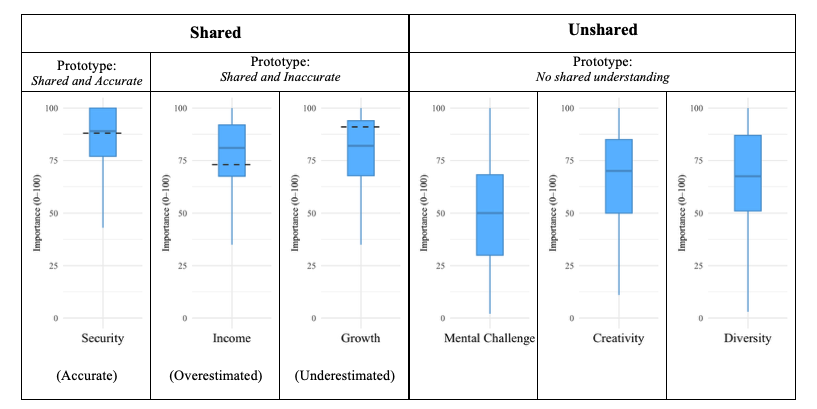

## Pressure toward societal ideals: Perceiving consensus in cultural directives for beauty standards

How do widely held beliefs control individual behavior?

## Cultural scripts and coordination: Consensus in third-order beliefs

Third-order beliefs—an individual's perception of what "most people" in a group believe—enable coordination. Past theorizing assumes that third-order beliefs are largely consensual in society. A closer examination of inferences about what most people believe about the importance of 18 work values reveals a selective sharedness—where some values exhibit consensus in third-order beliefs, while others show large diversity in what respondents think most people think. Our respondents were similar in their third-order ratings on importance of having high income*,* but showed diverse inferences about what most people thought about the ability to be creative at work. This finding suggests a limit to the amount of information that can be stored as a shared script about what most people value, where select symbols are shared enough to be used for coordination.

{fig-align="center"}

- **Smock, Regan** and Freda B. Lynn. Forthcoming. “Are Third-Order Beliefs Widely Held? An Empirical Examination of Third-Order Consensus”. *Advances in Group Processes.*

## Morality in context: Cultural beliefs structure moral judgments

Theories of moral judgement from antiquity to present day psychology aim to identify behaviors that are morally wrong. However, behaviors are not the only data individuals rely on to decide what is right and wrong. Variation in the situation, such as situational norms or social role expectations of the perpetrator and victim, impact how actors assess which behaviors are appropriate or untoward.

{fig-align="center" width="486"}

#### With great power comes great responsibility 

Respondents rated behavior as more morally wrong when perpetrated by a high power person than low power person, suggesting that we hold powerful people to higher moral expectations.

- **Smock, Regan**, Yongren Shi, and Steven Hitlin. 2025. "Social Role Expectations and Power Distance in Everyday Moral Blame Judgments." *Handbook of Social Psychology: Vol. 1: Micro Perspective.* Cham: Springer Nature Switzerland

#### Am I the Asshole? Situational norms and moral judgments in online community

Moral judgments changed across situational domains, where some situations had strong norms which resulted in voting convergence on an online forum.

- Shi, Yongren, **Regan Smock**, and Steven Hitlin. 2025. "Moral disagreement in everyday life: An inductive framework for capturing ‘moral order’." *Social science research.*
